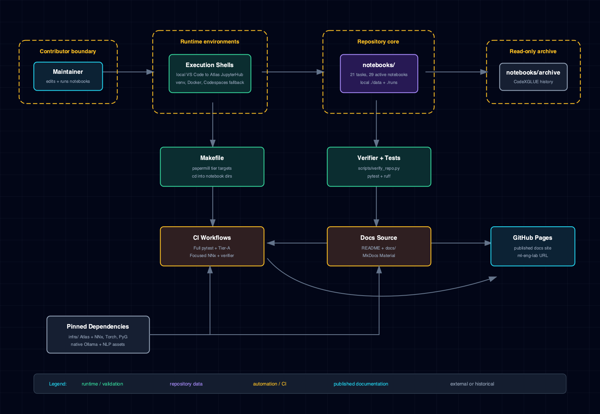
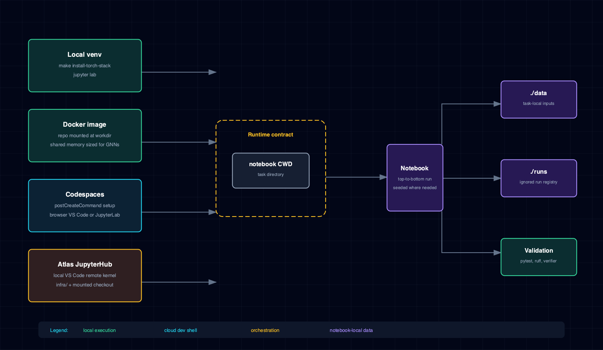
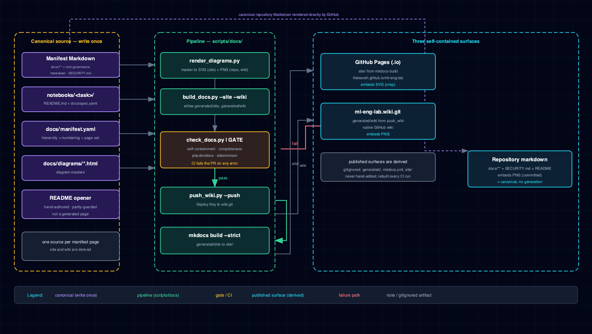
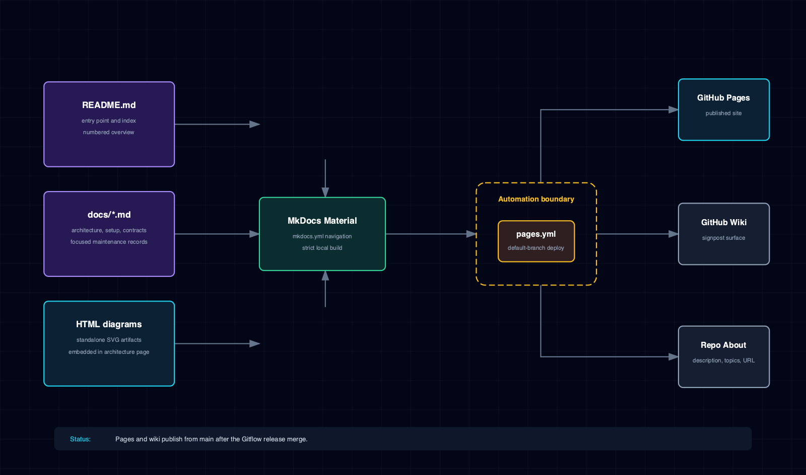

# 2.1 System & context view

This page describes the repository as a notebook-driven ML lab rather than as a deployable
service. The primary runtime objects are experiment directories under `notebooks/`, the notebook
execution tiers owned by the `Makefile`, the validation scripts under `scripts/`, and the three
documentation surfaces derived from the manifest-declared canonical source set. That set spans
the documentation tree under `docs/` and direct-root governance Markdown such as `SECURITY.md`.

## 2.1.1 System architecture

The system view establishes the ownership boundary: this repository owns notebook tasks,
consumer configuration, and verification, while NNx and Atlas remain separately versioned
upstream dependencies.

## 2.1.2 Three-surface documentation pipeline

The documentation system is the cleanest worked example of the lab's "canonical source +
derived surface" discipline. One manifest-declared canonical source set feeds three surfaces:

1. **Manifest.** `docs/manifest.yaml` declares the hierarchy, numbering, notebook specs, diagram
   masters, Markdown under `docs/`, and direct-root governance pages such as `SECURITY.md`. It is
   the single source of truth for the generated page set — if a page is not in the manifest, it
   does not appear in the generated site or wiki.
2. **Site generation.** `scripts/docs/build_docs.py --site` reads the manifest, applies the
   per-surface transforms in `scripts/docs/transforms.py` (forbidden-link stripping,
   path rewriting, image-asset rewriting), and writes `generated/site/` plus a generated
   `mkdocs.yml`. MkDocs Material then builds the published site from `generated/site/`.
3. **Wiki generation.** `scripts/docs/build_docs.py --wiki` applies the wiki surface transform
   (slugified numbered filenames, `Home.md` / `_Sidebar.md` / `_Footer.md` convention) and writes
   `generated/wiki/`. `scripts/docs/push_wiki.py` mirrors it to the GitHub wiki using a
   dedicated deploy key.
4. **Diagram rendering.** `scripts/docs/render_diagrams.py` rasterizes each manifest-declared
   HTML master to SVG (for the site) and PNG (committed under `docs/diagrams/img/` for the
   repository and wiki).
5. **CI gate.** `scripts/docs/check_docs.py` enforces self-containment (no cross-surface HTTP
   links), completeness (every manifest entry has a source file), placeholder-freeness, and
   generation determinism. It exits non-zero on any error.

The transforms guarantee that a link written once in a canonical source resolves correctly on
every surface: relative canonical paths are rewritten to per-surface output paths, image
references are rewritten to the surface-appropriate asset format, and any link that would cross
a surface boundary (a site page linking to a GitHub source view, for example) is stripped to
bare text.

The root `README.md` opener is hand-authored and parity-guarded against `docs/index.md`;
it is not a manifest-generated page. The repository renders both that opener and the canonical
manifest sources directly, while the site and wiki contain only manifest-projected pages.

## 2.1.3 Runtime entry paths

A contributor opens the repository through one of four supported entry paths — local VS Code with
the Atlas JupyterHub kernel, a local venv, the Docker image, or GitHub Codespaces — and runs or
edits an experiment under `notebooks/<task>/`. The Atlas path uses the pinned `infra/` submodule,
the `ml-eng` track, and a parent-owned checkout mount; local VS Code remains the default editor.
Notebook-local `./data/` and `./runs/` paths resolve inside each experiment directory; `Makefile`
targets execute notebooks by changing into each notebook directory before invoking papermill, so
the task-local path invariant holds.

`scripts/verify_repo.py`, the complete `make test` / `pytest-repository` contract, the focused NNx and Ruff job, documentation checks, and notebook execution tiers verify structure, documentation, library surfaces, and executable notebook behavior before changes are merged.

## 2.1.4 Boundary decisions

- `notebooks/archive/` is preserved as read-only historical material and excluded from active
  notebook validation.
- `thekaveh-nnx[lm]==0.2.0` is consumed from PyPI; shared library changes land upstream in
  `thekaveh/NNx` before this repo bumps the pin.
- The quantization notebook is active but manual-only until the pinned Torch stack can satisfy
  `torchao>=0.17`.
- `infra/` is a reviewed Atlas gitlink. Consumer configuration remains outside the submodule, and
  host-native Ollama is mandatory; a containerized Ollama service is not an approved runtime.
- The manifest-declared canonical source set under `docs/` and at approved root governance paths
  is the documentation source of truth; the generated site and wiki are never edited by hand.
