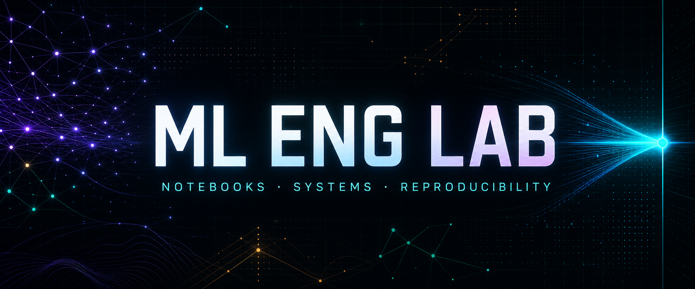

  

<h1 align="center">1 · ML ENG LAB</h1>

<strong>Local notebooks. Remote Atlas execution. Explicit infrastructure contracts.</strong>

  <strong>Core ML</strong> 
        

  <strong>NLP and graphs</strong> 
    

  <strong>Runtime</strong> 
     

  <strong>Engineering</strong> 
      

<!-- project-summary:start -->
ml-eng-lab is a portfolio of self-contained machine-learning notebook experiments built for
local editing in VS Code and recommended remote execution through JupyterHub on Atlas's ML
Engineering track. Unlike a loose notebook collection, each task declares its runtime needs in a
checked infrastructure contract, keeping notebook dependencies explicit as the lab expands beyond
JupyterHub. Narrative experiments, reproducible execution tiers, exact dependency pins, validation
gates, and the reusable thekaveh-nnx toolkit evolve together.

Contributors can use Browser
JupyterLab for mounted-workspace tasks or choose a local virtual environment, Docker, or GitHub
Codespaces when Atlas is not the right fit. Host-native Ollama is the only approved Ollama source
whenever a future task needs it; containerized Ollama is intentionally excluded. This makes the
lab both a practical portfolio and a controlled environment for growing machine-learning systems
without hiding operational assumptions inside notebooks.
<!-- project-summary:end -->

## 1.1 Repository map

- `notebooks/` contains twenty-one active task directories and twenty-nine active notebooks.
- `notebooks/archive/` contains preserved Aug-2023 CodeXGLUE summarization experiments.
- `scripts/verify_repo.py` is the fast structural, documentation, and notebook-surface verifier.
- `scripts/docs/` owns the three-surface documentation pipeline (manifest, transforms,
  renderers, checker).
- `Makefile` owns notebook execution tiers and local validation targets.
- `infra/` pins Atlas; its `ml-eng` JupyterHub runtime is the default remote notebook kernel.
- `docs/` holds the canonical documentation sources plus maintenance logs and findings.
- `.github/workflows/` contains CI and documentation publishing workflows.

The root `README.md` is the day-to-day entry point for contributors — it carries the task index,
quick-start paths, and the standard make targets. This documentation collection is the focused
reference surface that complements the README.

## 1.2 Documentation surfaces

The lab maintains three synchronized documentation surfaces, all derived from one canonical
source tree so the three never drift:

| Surface | Source | Rendered by | Audience |
|---|---|---|---|
| **Repository** | `docs/*.md` (checked in) | GitHub markdown rendering | Contributors browsing the repo |
| **Site** | `generated/site/` | MkDocs Material (`mkdocs build`) | Public readers of the published site |
| **Wiki** | `generated/wiki/` | GitHub wiki rendering | Readers who prefer the wiki navigation |

The manifest at `docs/manifest.yaml` is the single source of truth for the hierarchy, numbering,
and page set. `scripts/docs/build_docs.py` consumes the manifest and emits both generated
surfaces; `scripts/docs/check_docs.py` gates CI on self-containment, completeness, placeholders,
and determinism. The canonical sources are written once; every surface is a transform of them.

## 1.3 Recommended reading path

- [System & context view](architecture.md) for the repository context, the system diagram,
  and the three-surface pipeline.
- [Atlas pin-bump and service-admission runbook](atlas-pin-bump-runbook.md) for the infrastructure
  ownership boundary, native Ollama rule, and future service workflow.
- [Tabular classification — Iris MLP](notebooks/tabular_classification-iris-mlp-pytorch.md)
  for the exemplar comprehensive deep-dive — the canonical walk-through of one notebook end to
  end (problem, math, architecture, code, results, pitfalls, extensions).

All twenty-one active task deep-dives are available under section 8. The three links above are a
recommended starting path through that complete catalog.
