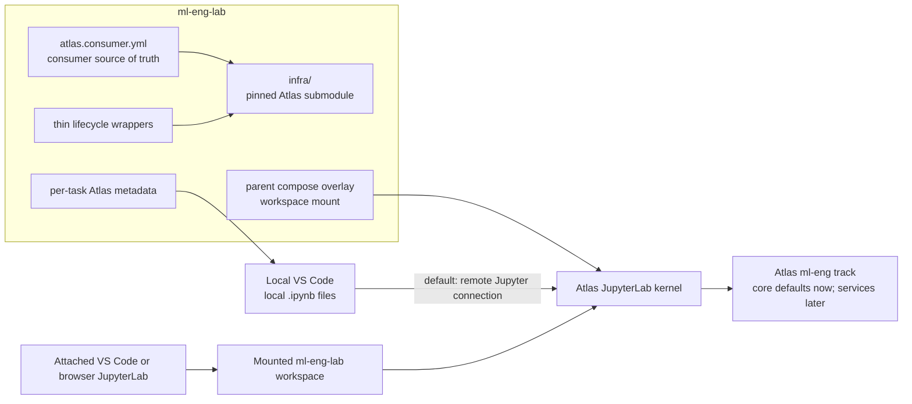

# Atlas infrastructure migration design

**Status:** Approved design
**Date:** 2026-07-30
**Decision:** Directly replace the legacy `vendor/genai-vanilla` runtime with Atlas, consumed as a pinned `infra/` Git submodule.

## 1. Purpose

`ml-eng-lab` is a notebook-first ML repository. Its existing JupyterHub path consumes a pinned
`vendor/genai-vanilla` submodule plus a parent compose override and wrapper. That repository was
the predecessor name of Atlas. This design replaces that legacy consumption seam with Atlas's
current, supported consumer contract while preserving the lab's preferred developer workflow:
open a local notebook in VS Code and attach it to a running remote Jupyter kernel.

The result makes infrastructure ownership, notebook runtime dependencies, upgrade discipline, and
future ML-service expansion explicit and verifiable. It does not turn every future Atlas service
on now.

## 2. Researched constraints and decisions

### 2.1 Consumer precedent

The current Atlas consumer model used by Tableau, RAG Showcase, Daydreams, and data-eng-lab is:

```text
parent repository
├── infra/                    # immutable Atlas gitlink
├── atlas.consumer.yml         # committed parent-owned configuration
├── compose/<consumer>.yml     # parent-owned overlay(s), if needed
├── scripts/                   # thin start/stop/verify wrappers
└── product source and docs
```

New consumers must use a root `atlas.consumer.yml` and invoke Atlas with
`./infra/start.sh --consumer <absolute-manifest-path>`. The legacy
`infra/services/_user/...` symlink pattern is intentionally excluded. Parent repositories do not
edit the submodule.

All sibling consumers use a detached, reviewed gitlink rather than a live branch. The most recent
sibling pin studied is data-eng-lab's `882877a4a168e5c611bfd3cff8704eeefcf97c9d`. This design pins
the newer reviewed Atlas `origin/main` revision observed during research:
`61c7c5103660e2226bf107c115dae42bf46f8374` (2026-07-29). The implementation records that exact
SHA as the `infra/` gitlink and does not add a `branch` field to `.gitmodules`.

### 2.2 Atlas behavior that affects this repository

- `ml-eng` is the appropriate track. It contains JupyterHub and the future-facing ML services
  (including Spark, Ray, MinIO, MLflow, and Label Studio).
- A track is not an instruction to enable every service. JupyterHub is enabled by default;
  Spark, Ray, MLflow, and Label Studio are disabled unless their source is deliberately selected.
- Atlas JupyterHub mounts a persistent work volume and its own example notebooks; it does not
  automatically mount a consumer repository. A parent overlay owns the optional workspace mount.
- Atlas's stable host endpoint export contract does not promise JupyterHub, Spark, Ray, MLflow, or
  Label Studio fields. Notebook code uses injected in-network environment variables when it has a
  declared service dependency. The local connection helper reads the Jupyter port and token from
  Atlas-managed local state instead of inventing an endpoint-export field.
- Atlas JupyterHub is an operator-trusted, single-user JupyterLab instance. Tokens, credentials,
  generated environment files, and local endpoint artifacts are never committed or embedded in
  notebook outputs.

### 2.3 Existing lab constraints

- There are 21 active task directories and 29 active Python 3.11 notebooks.
- The normal user workflow is VS Code connecting to a remote Jupyter server while the `.ipynb`
  remains on the host.
- The NumPy MNIST task imports eight non-packaged sibling Python modules, so it requires an
  accessible repository workspace inside the runtime. It cannot rely on remote-kernel mode alone.
- Existing notebook tests, papermill tiers, verifier checks, the three-surface documentation
  system, and the NNx PyPI contract are part of the migration boundary.
- Atlas's Jupyter image carries the lab's core ML packages but its Torch stack is newer than the
  repository's legacy `torch==2.4.1` contract. The migration validates and reconciles the
  repository dependency manifests against the chosen Atlas image before calling the runtime
  compatible. Quantization remains manual-only unless that validation proves otherwise.

## 3. Scope and non-goals

### In scope

- Replace the legacy submodule, compose override, launcher, verifier contract, and documentation
  with Atlas equivalents.
- Make Atlas JupyterHub the documented primary remote notebook runtime.
- Keep local VS Code to remote Jupyter as the default execution mode.
- Support a mounted-workspace fallback for tasks requiring sibling files or host-persisted task
  artifacts.
- Add machine-readable per-task Atlas dependency metadata and validate it.
- Establish static CI, manual/scheduled live smoke coverage, and an Atlas pin-bump runbook.
- Preserve local Docker, local venv, and Codespaces as supported non-Atlas execution paths.

### Explicit non-goals

- Enabling Spark, Ray, MinIO, MLflow, Label Studio, or other optional services merely because
  they belong to `ml-eng`.
- Rewriting present notebooks to use Atlas services when they do not need them.
- Introducing a custom consumer Jupyter image or session-time dependency installation.
- Editing files inside `infra/`.
- Treating browser JupyterLab or container-attached VS Code as the primary workflow.

## 4. Target architecture



The parent repository owns intent and integration. Atlas owns infrastructure implementation and
runtime state. Neither side duplicates the other's configuration.

## 5. Repository shape and ownership

### 5.1 Add or replace

| Path | Owner | Responsibility |
| --- | --- | --- |
| `infra/` | Atlas | Pinned Git submodule at `61c7c5103660e2226bf107c115dae42bf46f8374`; never edited from this repository. |
| `.gitmodules` | Parent | Declare the Atlas URL and `infra/` path only; no moving branch configuration. |
| `atlas.consumer.yml` | Parent | The single committed Atlas consumer contract. |
| `atlas.env.user.example` | Parent | Secret-free template for machine-local runtime settings. |
| `atlas.env.user` | Local operator | Ignored settings, including the absolute repository path required by the workspace mount. |
| `compose/ml-eng-lab-atlas.yml` | Parent | JupyterHub overlay that mounts the repository at `/home/jovyan/work/ml-eng-lab`. |
| `scripts/atlas-up.sh` | Parent | Headless, manifest-aware startup sequence. |
| `scripts/atlas-down.sh` | Parent | Project-scoped stop command. |
| `scripts/atlas-connect.sh` | Parent | Interactive helper that obtains the local Jupyter connection information without writing a secret-bearing artifact. |
| `docs/atlas-pin-bump-runbook.md` | Parent | Reviewed procedure for future immutable pin changes. |
| `docs/notebook-infrastructure.md` | Parent | Canonical task-by-task runtime contract; its table block is generated and checked from task metadata. |

The existing `vendor/genai-vanilla/`, `deploy/genai-vanilla-jupyterhub.override.yml`, and
`scripts/start-jupyterhub.sh` are removed only after their Atlas replacements pass the defined
static and runtime gates. The final tree contains `infra/` and no legacy vendor seam.

### 5.2 `atlas.consumer.yml`

The manifest uses only Atlas-supported keys. Its durable contract is:

- `name` and `project_name`: `ml-eng-lab`.
- `profile`: `dev`.
- `brand.name`: `ML Eng Lab`.
- `env.file`: `./atlas.env.user`.
- `env.values.BASE_PORT`: `auto`, allowing coexistence with the other Atlas consumers.
- `env.values.JUPYTERHUB_SOURCE`: `container`.
- `compose_overlays`: `./compose/ml-eng-lab-atlas.yml`.

The manifest intentionally has no `track` key. The valid manifest schema does not provide one;
the lifecycle wrapper passes `--track ml-eng`. It also deliberately does not set sources for
future services. Their Atlas defaults remain in force until a concrete notebook declares one.

`atlas.env.user` contains only operator-specific values such as `ML_ENG_LAB_REPO_PATH`, not
committed configuration, credentials, dynamic ports, or model choices.

### 5.3 Lifecycle commands

`make atlas-up` delegates to `scripts/atlas-up.sh`, which resolves the repository root and uses
an absolute manifest path. Its deterministic sequence is:

1. Confirm that `infra/start.sh` and the consumer manifest exist.
2. Run `env backfill`.
3. Run consumer-aware `compose validate`.
4. Run consumer-aware `doctor --format json`.
5. Start with `--consumer <absolute-manifest> --track ml-eng --no-tui --detach`.
6. Confirm the `infra/` worktree remains clean.

No source flags are baked into the wrapper: explicit source flags are persistent Atlas overrides
and would compete with the manifest or future operator intent.

`make atlas-down` uses a project-scoped Atlas stop command and never uses a cold stop by default.
A cold stop removes volumes and is documented as an explicit data-loss action.

`make atlas-connect` is interactive only. It retrieves the running Jupyter port/token from the
local Atlas state and prints the VS Code connection workflow. It neither stores the token in the
repository nor expects an unsupported Jupyter endpoint-export variable.

## 6. Notebook execution contract

### 6.1 Default: VS Code remote kernel

The default mode is:

1. Start Atlas with `make atlas-up`.
2. Open the local notebook in VS Code.
3. Select the Atlas Jupyter server through VS Code's Jupyter connection command.
4. Use the remote Python kernel while the `.ipynb` remains in the local checkout.

This supports normal notebook editing and prevents the container from becoming the source of
truth for committed notebooks. Relative runtime paths in this mode resolve in the Atlas Jupyter
work volume, so new task-local data and run artifacts are persistent in Atlas but not visible in
the host checkout.

### 6.2 Fallback: mounted workspace

The parent compose overlay mounts the local checkout at
`/home/jovyan/work/ml-eng-lab`. Users select this mode by attaching VS Code to the Jupyter
container or opening the browser JupyterLab and opening the mounted project directory.

This mode is required for the NumPy MNIST task, whose notebook imports sibling files such as
`utils.py` and `feed_fwd_nn.py`. It is also the documented choice when task-local `data/` or
`runs/` must be persisted on the host. Those paths remain ignored by Git.

### 6.3 Per-task machine-readable metadata

Each active task's existing `notebooks/<task>/docs/spec.yaml` gains:

```yaml
atlas:
  executor: jupyterhub
  default_mode: vscode-remote
  required_services: [jupyterhub]
  workspace_access: remote
  artifact_policy: atlas-jupyter-volume
  constraints: []
```

Allowed `workspace_access` values are `remote` and `mounted-required`. Allowed
`artifact_policy` values are `atlas-jupyter-volume` and `task-local-ignored-paths`.
`constraints` is a non-empty list only for active runtime caveats.

The initial classification is:

| Tasks | Workspace access | Direct Atlas services | Constraints |
| --- | --- | --- | --- |
| All active tasks except the NumPy MNIST and quantization tasks | `remote` | `jupyterhub` | Existing tier and platform caveats remain authoritative. |
| `image_classification-mnist-ffnn-numpy` | `mounted-required` | `jupyterhub` | Sibling Python modules require the mounted checkout. |
| Quantization task | `remote` | `jupyterhub` | Manual-only until Atlas Jupyter package validation passes. |

The task metadata drives the generated table block in the canonical
`docs/notebook-infrastructure.md` page. The documentation check compares the block to the
metadata, and a validator prevents an active task from omitting or misspelling the contract.

### 6.4 Future Atlas services

When a new or changed task needs Spark, Ray, MinIO, MLflow, Label Studio, or another Atlas
service, its task spec is changed first. The same change then:

1. Enables and configures the service centrally in `atlas.consumer.yml`.
2. Documents the in-network environment contract in the task documentation.
3. Adds a targeted runtime smoke.
4. Updates the dependency page and pin-bump requirements if a new exported host contract is
   consumed.

Notebook code uses only Atlas-provided in-network names and variables such as `SPARK_REMOTE`,
`RAY_ADDRESS`, `MLFLOW_TRACKING_URI`, and `AWS_ENDPOINT_URL_S3`; it never invents
`localhost:<port>` fallbacks. A service's absence is an actionable configuration error, not an
implicit optional code path.

## 7. Dependency compatibility policy

Atlas JupyterHub becomes the authoritative primary-runtime package contract. The repository's
`requirements.txt`, `torch-core-requirements.txt`, `torch-requirements.txt`, Dockerfile, devcontainer
instructions, and dependency ledger must be reconciled deliberately rather than assuming that the
legacy Torch 2.4.1 pins are compatible with Atlas's newer Jupyter image.

Before the legacy vendor is removed, the implementation creates and runs a focused in-container
probe for:

- Python version and `nnx` distribution/version;
- Torch, TorchVision, TorchAudio, TorchAO, and PyTorch Geometric import surfaces;
- the `thekaveh-nnx[lm]` import surface;
- spaCy's `en_core_web_sm` and NLTK's VADER asset;
- all active notebook direct imports.

Tier A is re-executed only after this contract is confirmed. Tier B/C keep their existing smoke and
preserved-output rules. The manual-only quantization designation changes only when its explicit
Atlas runtime smoke succeeds; it is not inferred from a version number.

## 8. Verification and CI

### 8.1 Static Atlas contract job

An `atlas-contract` CI job is added for changes touching Atlas configuration, wrappers, docs, or
the `infra` pointer. It:

1. Checks out recursive submodules.
2. Creates disposable, secret-free `infra/.env` state.
3. Runs `env backfill`.
4. Runs consumer-aware `compose validate`.
5. Runs consumer-aware `doctor --format json`.
6. Fails if the submodule is dirty or the manifest/overlay cannot be assembled.

It does not start Docker services, expose ports, or need user credentials.

### 8.2 Parent-repository checks

- Update `scripts/verify_repo.py` from the hard-coded legacy submodule path to `infra/` and
  validate its clean gitlink/worktree state.
- Update the dependency-ledger SHA assertion to compare the documented Atlas SHA to the actual
  `infra` gitlink.
- Add tests for the manifest structure, per-task `atlas` metadata schema, wrapper dry-run behavior,
  no hard-coded host service endpoints in executable integration code, and the new verifier rules.
- Keep existing `make verify`, `make test`, `make lint`, docs, NNx-surface, and papermill gates.

### 8.3 Opt-in live runtime smoke

A manual or scheduled Docker-backed job starts Atlas and confirms:

- JupyterHub reaches health;
- the package probe succeeds;
- a local VS Code-compatible remote-kernel connection is obtainable;
- the mounted-workspace fallback can import the NumPy task's sibling modules;
- `infra/` remains clean after startup and shutdown.

The live smoke is not an every-PR service start. It provides release evidence for Atlas pin bumps
and runtime changes without making ordinary PR CI costly or secret-dependent.

## 9. Documentation changes

Canonical documentation is updated once and projected through the existing repository/site/wiki
pipeline. The migration changes:

- `README.md`: primary Atlas quick start, default VS Code remote mode, mounted fallback, and
  submodule initialization.
- `CONTRIBUTING.md`: Atlas ownership boundary, task metadata requirement, validation and future
  service activation workflow.
- `docs/env-setup.md`: Atlas as primary Jupyter runtime, with Docker/venv/Codespaces retained.
- `docs/jupyterhub-integration.md`: Atlas startup, mode choice, persistence, credentials, and
  failure modes.
- `docs/vscode-remote-access.md`: the default remote-kernel instructions plus mounted fallback.
- `docs/architecture.md` and `docs/diagrams/ml-eng-lab-system.html`: Atlas ownership and both
  notebook execution modes.
- `docs/dependency-contracts.md`: Atlas gitlink and Jupyter package compatibility ledger.
- `docs/notebook-infrastructure.md`: canonical runtime guide with a generated, drift-checked
  task-to-runtime service map.
- `docs/atlas-pin-bump-runbook.md`: immutable revision update procedure.
- `docs/FINDINGS-VENDOR.md`: replace with an Atlas findings ledger and update all references.
- `docs/manifest.yaml`: register new canonical documentation pages.

The migration regenerates and validates all three documentation surfaces. Generated files remain
uneditable outputs.

## 10. Error handling and security

- Startup fails early with a clear `git submodule update --init --recursive` instruction when
  `infra/` is absent or uninitialized.
- The wrapper refuses to start after failed backfill, compose validation, or doctor checks.
- `BASE_PORT: auto` avoids predictable collisions across local Atlas consumers; doctor reports
  remaining port conflicts before services start.
- Jupyter tokens, `atlas.env.user`, `infra/.env`, `infra/.env.user`, endpoint artifacts,
  `infra/volumes/`, `infra/data/`, and Atlas build state are ignored. Documentation never asks
  users to commit a token-bearing URL.
- The workspace mount is local/operator controlled. It does not mount host SSH credentials by
  default.
- No service port is hard-coded into notebook source. All future service contracts distinguish
  host-visible endpoints from in-network Jupyter variables.
- `atlas-down` is safe and project-scoped; `--cold` is documented separately because it destroys
  persisted volumes.

## 11. Migration sequence and acceptance criteria

### 11.1 Ordered migration

1. Add the Atlas `infra/` gitlink, consumer manifest, ignored local-env template, overlay, and
   lifecycle helpers.
2. Add static manifest/metadata/verification tests and the non-live CI contract job.
3. Establish Atlas Jupyter package compatibility, reconcile dependency manifests, and run the
   required notebook validation tiers.
4. Add the task metadata, canonical runtime page, updated documentation, and system diagram.
5. Validate a clean clone, remote VS Code workflow, and mounted NumPy fallback.
6. Remove the legacy vendor submodule, override, launcher, findings ledger, and every obsolete
   reference in the same completed migration.
7. Run the full repository, documentation, and Atlas-contract checks; commit the exact `infra`
   gitlink with the final documentation changes.

### 11.2 Definition of done

The migration is complete only when all of the following are true:

- A clean clone can initialize `infra/` recursively and pass the Atlas static contract without
  starting services.
- `make atlas-up` starts the `ml-eng` track through the consumer manifest and leaves `infra/`
  clean.
- A contributor can connect a local VS Code notebook to the Atlas Jupyter kernel using the
  documented default workflow.
- The NumPy MNIST task works through the documented mounted-workspace mode.
- The Atlas Jupyter dependency probe and all required notebook tests are green; the quantization
  status reflects observed validation rather than an assumption.
- Every active task has validated Atlas metadata and the published runtime table matches it.
- The README, canonical docs, site, wiki, architecture diagram, verifier, CI, and pin-bump runbook
  contain no `genai-vanilla` legacy-contract instructions.
- No secret, generated environment file, endpoint artifact, or local Atlas runtime state is tracked.
